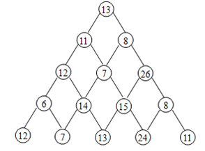
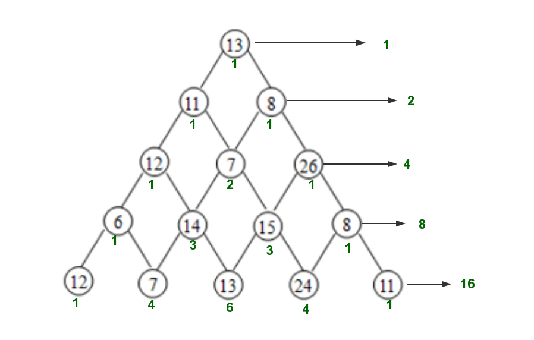
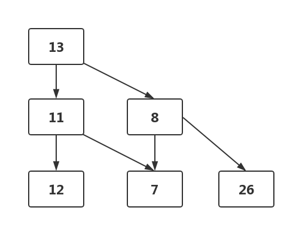

## 引入:数塔问题(NOIP)

题目地址:cogs 77

### 问题描述

设有一个三角形的数塔，顶点结点称为根结点，每个结点有一个整数数值（小于3000）。从顶点出发，可以向左走，也可以向右走。如图所示：从根结点13出发，向左走到达11，再向右走到达7，再向左走到达14，再向左走到达7.由于7是最底层，无路可走。此时，我们找到一条从根结点开始到达底层的路径：

```
13--11--7--14--7
```

路径上结点中数字的和称为路径的值，如上面路径的值为13+11+7+14+7=52。同时，从图中可以看到除了上述路径外，还存在其他的路径，如：

```
13--11--12--14--13
```

其路径的值为63。

问题：当三角形数塔给出后，找出一条路径，使路径上的值为最大。若这样的路径存在多条，选根部偏左的路径。



### 【输入格式】

输入由若干行组成，第一行有一个整数，n（1≤n≤80）；n表示数塔的层数。第2至n+1行是数塔的信息。

### 【输出格式】

输出由两行组成，第一行有一个整数，为所选路径的值。

第二行有n个整数，为所选路径，中间用一个空格隔开。

### 【输入样例】

```
5
13
11 8
12 7 26
6 14 15 8
12 7 13 24 11
```
### 【输出样例】

```
86
13 8 26 15 24
```

## 分析1:使用搜索

如果使用DFS,可以使用下面的DFS树来表示搜索过程:



每个点上的值代表这个以这个点为结尾的**搜索路径**有多少种.

对于4层的数塔来说,一共搜索:$$2^{4-1} =8$$次,显然对于`n`层数塔来说,搜索次数如下:

```math
2^{n-1}
```

如果有100层,搜索一定会超时.


我们可以写出一个搜索的代码:

```c
#include <cstdio>

//二维数组存数塔
int s[100][100];
int path[100];//存路径
int _path[100];//存路径
int n;
int max=0;
int sum=0;

void path_copy(){
    int i;
    for(i=1;i<=n;i++)
        _path[i] = path[i];
}

void dfs(int x,int y){
    if(x == n+1){
        if( max < sum){
            max =sum;
            path_copy();
            //memcpy(_path,path,100*4);
        }
        return;
    }
    int i,j;
    path[x] = s[x][y];
    sum += s[x][y];
    dfs(x+1,y);
    sum -= s[x+1][y];
    dfs(x+1,y+1);
    sum -= s[x+1][y+1];
}

int main(){
    scanf("%d",&n);
    int i,j;
    for(i=1;i<=n;i++)
        for(j=1;j<=i;j++)
            scanf("%d",&s[i][j]);
    dfs(1,1);
    printf("%d\n",max);
    for(i=1;i<=n;i++)
        printf("%d ",_path[i]);
    return 0;
}
```


## 分析2:使用动态规化的思想

我们按下面的方式来存数塔



通过上面我们已经知道:使用搜索面对小的数据可以求出答案,但是面对大的数据的时候就会运行很长的时间(超时:TimeError).

搜索慢的原因本质上是对子问题进行了重复的计算: 比如想知道到达`14`这个点的最大值,DFS要来到这个点三次,才能知道.


我们发现如果想知道到达`14`这个点的最大值,其时候只要需要知道从起点到达`12`,`7`的最大值就行了.如果把这种想法放到整体上来说:设$$f[i][j]$$从起点到达第i层第j个点的最大值.那么显示:

```math
f[i][j] = a[i][j]+max\{f[i-1][j-1],f[i-1][j]\}
```

其中$$a[i][j]$$代表第i行,第j个点的值,$$f[i-1][j-1],f[i-1][j]$$代表$$f[i][j]$$上面的两个点

这样数塔问题可以形像化的如下图所示:


## 数塔的DP思想


### 重叠子问题

是上面所说如果我们想要求到达`14`这个点的最大值,通过搜索的话要多次达到这个点才能求出值.但是使用DP的话,我们只需要求出一次的值.

### 最优原理

原问题求**从起点到最后一层的最大值**,转换成到点$$[i][j]$$的最大值,记为:$$f[i][j]$$

问题$$f[i][j]$$,分成子问题:$$f[i-1][j-1],f[i-1][j]$$

### 多阶段决策

数塔的每一层都是一个阶段.如果想求出第n个阶段的值,必须要求出n-1这个阶段的值.

### 无后效性

当求出第n-1阶段的值后,那个n-1阶段的值只会影响第n阶段之后的值,不会影响`1->n-2`阶段的值.也就是说:**一旦作出决定,就不会变化了**

### 高加高效

对于n层数塔,使用搜索算:

```math
2^{n-1}
```

使用DP:

```math
1+2+3+....+n
```

DP可以很高效的算出来


## DP代码

```c
#include <cstdio>

//二维数组存数塔
int s[100][100]={0};
int f[100][100]={0};
int path[100][100];//存路径
int _path[100];
int n;
int max=0;
int sum=0;

int main(){
    scanf("%d",&n);
    int i,j;
    for(i=1;i<=n;i++)//读入
        for(j=1;j<=i;j++)
            scanf("%d",&s[i][j]);
    f[1][1] = s[1][1];
    
    for(i=2;i<=n;i++)
        for(j=1;j<=i;j++){
            int m;
            if(f[i-1][j-1] >=f[i-1][j]){
                m = f[i-1][j-1];
                path[i][j] = j-1;
            }
            else {
                m = f[i-1][j];
                path[i][j] = j;
            }
            f[i][j] = s[i][j]+ m;
        }
    int _max = 0;
    int _max_index; // 最后一层,最大的那个下标
    for(i=1;i<=n;i++)
        if(max < f[n][i])
            max = f[n][i],_max_index = i;
    printf("%d\n",max);

    // 求路径
    int idx;
    _path[n] = s[n][_max_index];
    idx = path[n][_max_index];
    for(i=n-1;i>=1;i--){
        _path[i] = s[i][idx];
        idx = path[i][idx];
    }
    for(i=1;i<=n;i++)
        printf("%d ",_path[i]);
    return 0;
}
```
