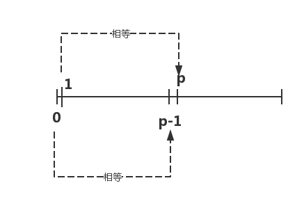

# BSGS baby steps giant steps


## 引入

### 问题描述

有如下公式:

```math
a^x \equiv b( \bmod p)
```
其中$$a,b,p$$为正整数,$$p$$为素数,求出最小的非负整数$$x$$

### 样例输入


```
2 15 17
```


### 样例输出

```
5
```


## 分析

### 阶段一: 


首先我们证明:

```math
a^{k \bmod p-1} \equiv a^k(\bmod p)
```

我们写出公式:

根据费马小定理:当$$p$$为素数且$$gcd(a,b)=1$$(互质)时:

```math
a^{p-1} \equiv 1(\bmod p)
```

也就是说下面公式成立:

```math
(a^{p-1})^m \equiv 1(\bmod p)
```

根据:**除以一个数取模等于乘以这个数的逆元取模**,$$(a^{p-1})^m$$的逆元为$$1$$,那么下面公式成立:

```math
\frac{a^k}{a^{m(p-1)}} \equiv a^k \cdot (\bmod p)
```

也就是说:

```math
a^{k-m(p-1)} \equiv a^k(\bmod p)
```

那就是说:

```math
a^{k \bmod p-1} \equiv a^k(\bmod p)
```

最终说明:当$$p$$为素数且$$gcd(a,b)=1$$(互质)时,$$a^k mod p$$的值

```math
\begin{matrix}
a^{p} = a^{p \bmod p-1} \bmod p = a^{1} \\
a^{p-1} = a^{p-1 \bmod p-1} = a^{0}
\end{matrix}
```



### 阶段二

我们令$$x=i \cdot m -j,m=\left \lceil  \sqrt{q}\right \rceil$$,得到

```math
a^{im-j} \equiv b(\bmod p)
```

移项:

```math
(a^m)^j \equiv b\cdot a^j(\bmod p)
```


当$$i,j$$取值如下时,我们得到以下表格,其中显然$$m^2 =p $$

| i   | j     | i*m-j                        |
|-----|-------|------------------------------|
| 1   | [0,m] | [m,m-1,m-2,....0]            |
| 2   | [0,m] | [2m,2m-1,2m-2,...m]          |
| 3   | [0,m] | [3m,3m-1,3m-2,...2m]         |
| ... | ...   | ...                          |
| m   | [0,m] | [m^2,m^2-1,m^2-2,...m*(m-1)] |

## 题目


经典的裸题SDOI2011 计算器

题目解析 http://hzwer.com/5878.html
