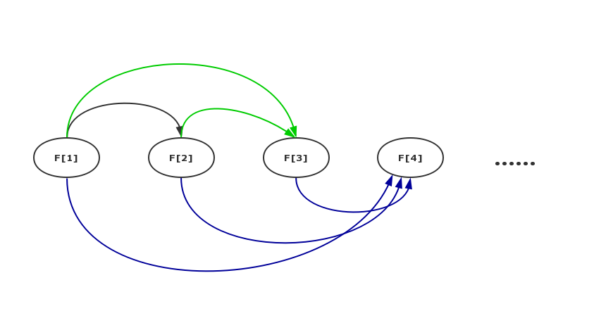

# LIS最长不下降子序列


最长上升子序列（Longest Increasing Subsequence，LIS），在计算机科学上是指一个序列中最长的单调递增的子序列。


## 求最大的LIS的长度

### 问题描述

一个数的序列$$b_i$$，当$$b_1 < b_2 < ... < b_n$$的时候，我们称这个序列是上升的(不下降)。对于给定的一个序列$$a_1, a_2,...a_n$$，我们可以得到一些上升的子序列$$a_{i1}, a_{i2},..., a_{ik}$$，这里$$1 <= i1 < i2 < ... < ik <= n$$。比如，对于序列$$(1, 7, 3, 5, 9, 4, 8)$$，有它的一些上升子序列，如$$(1, 7)$$,$$(3, 4, 8)$$等等。这些子序列中最长的长度是4，比如子序列$$(1, 3, 5, 8)$$.
你的任务，就是对于给定的序列，求出**最长上升(不下降)子序列的长度**。

### 输入样例


```
6
3 4 1 2 3 6
```

### 输出样例

```
4
```

### 样例解释

`(1 2 3 6)`为最长的上升子序列

### 解题思路

这个问题的是:**求序列的最长序列的长度**

如何把这个问题分解成子问题呢？经过分析，发现:**求以$$a_k(k=1, 2, 3,...N)$$为终点的最长上升子序列的长度**是个好的子问题.

这里把一个上升子序列中最右边的那个数，称为该子序列的“终点”。虽然这个子问题和原问题形式上并不完全一样，但是只要这N个子问题都解决了，那么这N个子问题的解中，最大的那个就是整个问题的解。

由上所述的子问题只和一个变量相关，就是数字的位置。因此序列中数的位置k 就是“状态”，而状态 k 对应的“值”，就是以$$a_k$$做为“终点”的最长上升子序列的长度。这个问题的状态一共有N个。状态定义出来后，转移方程就不难想了。假定$$F(k)$$表示以$$a_k$$做为“终点”的最长上升子序列的长度，那么：

**状态转移方程:**

```math
F[k] = Max\{F[i]+1\},1\leqslant i&lt; k,a[i]&lt;a[k],k&gt; 1
```

这个状态转移方程的意思就是，$$F(k)$$的值，就是在$$a_k$$左边，“终点”数值小于$$a_k$$，且长度最大的那个上升子序列的长度再加1。因为$$a_k$$左边任何“终点”小于$$a_k$$的子序列，加上$$a_k$$后就能形成一个更长的上升子序列。



**边界,或者说刚开始时,初始化时:**

$$F(i) = 1$$

可以这样理解:刚开始时,以下标i为结尾的LIS就是下标i自己本身,所以长度为1.


实际实现的时候，可以不必编写递归函数，因为从$$F(1)$$就能推算出$$F(2)$$，有了$$F(1)$$和$$F(2)$$就能推算出$$F(3)$$,后面同同理.

### 感性的理解

我们可以把LIS理解如下:

有6个小朋友`A,B,C,D,E,F`玩一个游戏,排列一排,每个人都有一个积分值如下:


游戏规则如下:

 - 每个人都只能看到左边的每个小朋友的积分
 - 积分大的人可以要求左边的比小(等于也可)的人作为自己的`跟班`,但只能选一个
 - `跟班`也可以选一个`跟班`
 - 自己和`跟班`(跟班的跟班也算)组成的队伍的长度,称为**强大值**
 - 越往右的小朋友身体越**强状**
 - 现在问每个朋友的**强大值**是多少?

想一想:如果你是最后一个小朋友F,你很聪明(狡猾),你是最强壮的,但是也很懒惰(`人类进步的原动力`),不想通过观察每个小朋友的积分来计算自己的**强大值**,你应该怎么办?仔细思考一段时间!

**小朋友F可以这们做:**

 - 观察左边所的小朋友积分,记住那些积分比自己小的人
 - 你利用自己强壮身体**威胁**积分比自己小的人(`A,B,C,D,E`都比自己小)
 - 你说:**把你们各自的强大值告诉我,不然就尝尝我沙包大的拳头!**
 - F不管他们(`A,B,C,D,E,F`)的强大值是怎么计算出来的!
 - 如果F知道了这些信息(`A,B,C,D,E`各自的强大值),他选出一个最大值后加1,就是自己的**强大值**
 - **F聪明在:把自己的问题抛给了别人**,分解子问题

**如果你是被F威胁的小朋友E,你应该怎么做?**

你只要学F一样霸道,去威胁你前面的小朋友即可.这种操作还是分解子问题

**那么谁最容易计算强大值?**

第一个小朋友,他知道自己永远是1.


一个小小的感想,如何在这个游戏中的小朋友要得到尽可能大的**强大值**,他需要:

  - 天时:自己分配到的初始积分高
  - 地利:位置要靠右
  - 人和:自己的努力,身体要比左边的人强壮


### 代码如下

```c
#include <cstdio>

int a[1000];
int n;
int f[1000];

int main(){
    scanf("%d",&n);
    int i;
    int j;
    for (i=1;i<=n;i++){
        scanf("%d",&a[i]);
    }

    for(i=1;i<=n;i++) f[i] =1;

    int max = -1;//这里是-1,想想为什么
    for (i=2;i<=n;i++){
        for(j=1;j<i;j++){
            if( a[j] < a[i] && f[i] < f[j]+1){
                f[i] = f[j]+1;
                if(max < f[i])
                    max = f[i];
            }
        }
    }
    
    printf("%d",max);

    return 0;
}
```

## 输出字典序最小的LIS

现在问题加上一个条件:输出最大lis,如果有多个lis满足条件，那么我们想求字典序最小的那个。如序列`(1 7 5 2)`最长的LIS有两个`(1 7 2)`和`(1 5 2)`,应该输出`1 5 2`


### 思路

在有同样长度的LIS的情况下如何保证输出**字典序最小**的LIS?

**我们只要保证每次转移的时候选接在最小的那个值后面即可!**

如对于`1 7 5 2`来说,`a[2]=7,a[3]=5`,`f[2]=2,f[5]=5`,最后一个数字`2`接在`7`或`5`后面都行,但我们选较小的`5`

注意情况二:序列`(1 2 5 6 3)`,有两个最长的LIS,这个时候我们要选一个末尾数字最小的LIS.

### 代码

```c
#include <cstdio>

int a[1000];
int n;
int f[1000];
int path[1000];//path[i]=j表示 a[i]接在a[j]后面
int _path[1000];

int main(){
    scanf("%d",&n);
    int i;
    int j;
    for (i=1;i<=n;i++){
        scanf("%d",&a[i]);

    }

    for(i=1;i<=n;i++) f[i] =1,path[i]=-1; //初始化

    int max = -1;//存最大LIS的长度
    int max_idx; //存最长的LIS的最后一位的下标
    for (i=2;i<=n;i++){
        for(j=1;j<i;j++){
            if( a[j] < a[i] && f[i] < f[j]+1){
                f[i] = f[j]+1;
                if(max < f[i]){
                    max = f[i];
                    path[i] = j; //a[i]接在a[j]后面
                    max_idx=i; //最后一个下标变为i
                }
                else if(max == f[i] && a[max_idx] > a[i]){ 
                        //max和当前的lis长度一样
                        //上一个最大lis的结尾的值比现在大
                        max_idx = i;
                }
            }
        }
    }
    
    printf("%d\n",max); //输出最大值
    //输出路径
    int cnt = 1;

    for(i=max_idx;i!=-1;i=path[i]){
        _path[cnt++] = a[i];
    }
    for(i=cnt-1;i>=1;i--)
        printf("%d ",_path[i]);

    return 0;
}
```


## n*log(n)的优化--利用用二分查找


数据,代码,思路都由Riolu(2014)提供

帮助理解的数据


```c
a: 7 2 9 3 4 10 6 1
b: 1 1 2 2 3  4 4 1

c: 7
   2
   2 9
   2 3
   2 3 4
   2 3 4 10
   2 3 4 6
   1 3 4 6
-----------------
下 1 2 3 4  5
标
```

**核心:**c[i]表示长度为i的LIS最小右端值,且c[i]一定一个上升的序列


```c
int a[n],c[n],f[n],m;
//a 为数组,f存最大长度
//c是符合条件的最长非降序列
//c[i]表示长度为i的LIS最小右端值

memset(c,0x7f,siezof);

int LIS(){
    int i;
    for(i=1;i<=n;i++){
        int min=1,max=i;

        while(min<max){     //寻找最大c[x],使c[x]<=a[i]
            int mid  = (min+max)>>1;
            if(c[mid] <= a[i])
                min = mid+1;
            else
                max= mid;
        }

        f[i]=min;   //保有答案
        c[min]=a[i];//更新最小值
    }
    return f[n];
}
```

## 练习题目

 - [P1020 导弹拦截](https://www.luogu.org/problemnew/show/P1020)
 - [P1091 合唱队形](https://www.luogu.org/problemnew/show/P1091)
 - [uscao 4.3 buy low but lower](https://www.luogu.org/problemnew/show/P2687)
 - [友好城市](https://www.luogu.org/problemnew/show/P2782)
 - [P2215 HAOI2007上升序列](https://www.luogu.org/problemnew/show/P2215)
 - [P2501 HAOI2006数字序列](https://www.luogu.org/problemnew/show/P2501)
